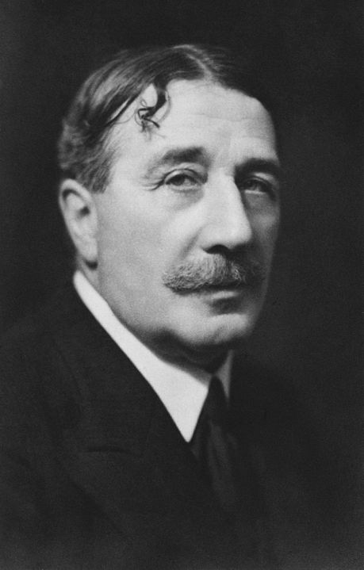

<!--

author: Moritz Riemann
email:  riemann@philsem.uni-kiel.de
version: 0.1
language: en
narrator: UK English Female

-->

# Simone Weil: Krieg und Gewalt

**Dozent:**

* Moritz Riemann (riemann@philsem.uni-kiel.de)

**Zeit und Raum:** Dienstag, 12-14, LMS11a - R.EG.004

**Inhalt**

* Geschichte der Philosophie: Gegenwart (BA 2)
* Einführung in die praktische Philosophie (BA 4)
* Praktische Philosophie: Vertiefung (BA 6)
* Philosophische Reflexion und ethische Urteilskraft

**Literatur**

* Simone Weil: Krieg und Gewalt - Essays und Aufzeichnungen. Zürich 2011.
* Simone Weil: Deutschland wartet. In: Zur proletarischen Revolution. Syndikalistische Schriften (1931–1934). Wien 2024.
* Simone Weil: Reflexionen über die Ursachen der Freiheit und sozialen Unterdrückung. Zürich 2012.

### Semesterplan

| Datum | Thema, Inhalt |
|-------|---------------|
| 16.04.2024 | Eröffnung, Organisatorisches |
| 23.04.2024 | Deutschland wartet |
| 30.04.2024 | Gedanken über den Krieg |
| 07.05.2024 | Antwort auf eine Frage von Alain; Spanisches Tagebuch; Missliebige Gedanken |
| 14.05.2024 | Beginnen wir den trojanischen Krieg nicht von Neuem |
| 21.05.2024 | Gedanken über die Barbarei; Einige Überlegungen zu den Ursprüngen des Hitlerismus |
| 28.05.2024 | Einige Überlegungen zu den Ursprüngen des Hitlerismus |
| 04.06.2024 | Die Ilias oder das Poem der Gewalt |
| 11.06.2024 | Die Ilias oder das Poem der Gewalt |
| 18.06.2024 | Dieser Krieg ist ein Krieg von Religionen |
| 25.06.2024 | Reflexionen über die Ursachen der Freiheit und sozialen Unterdrückung (Auszug) |
| 02.07.2024 | Reflexionen über die Ursachen der Freiheit und sozialen Unterdrückung (Auszug) |
| 09.07.2024 | Abschlussdiskussion |

### "Regierungserklärung"

1. Die Teilnahme am Seminar erfordert die vorbereitende, gründliche Lektüre der Texte.
2. Eine regelmäßige und aktive Teilnahme aller Seminarteilnehmenden ist Voraussetzung für ein gelingendes Seminar.
3. Philosophische Seminare leben vom diskursiven Austausch. Nehmt in Euren Diskussionsbeiträgen auf den Text und aufeinander Bezug, lasst einander ausreden und vermeidet lange, abschweifende Exkurse.
4. Meine Sprechsstunde (Mittwoch 16:15) ist offen für alle Anliegen, es ist keine Anmeldung erforderlich.
5. Bevor Ihr eine Email schreibt: Seht im Seminarplan nach, ob die gesuchte Information dort zu finden ist.

### Prüfungsleistungen

**BA 2:**

* Ergebnisprotokoll im Umfang von 2-3 Seiten. Das Protokoll soll die wesentlichen Inhalte einer Seminarssitzung ergebnisorientiert und systematisch zusammenfassen. Die Anmeldung zum Protokoll erfolgt zu Beginn der Sitzung. Es ist bis Montag, 12 Uhr nach der protokollierten Sitzung im OLAT-Teilnehmerordner hochzuladen und dient damit der Rekapitulation zu Beginn der folgenden Sitzung. Beachten Sie die Handreichung zum Erstellen eines Protokolls im OLAT-Ordner

**BA 4:**

* Take-Home-Klausur im Umfang von 5-6 Seiten. Die Aufgabenstellung erfolgt in der letzten Sitzung. Abgabe: 30.09.2024

**BA 6:**

* Hausarbeit im Umfang von 10 Textseiten. Individuelle und eigenständige Themenfindung aus dem Themenbereich des Seminars. Ein persönliches Gespräch mit dem Dozenten (Sprechstunde) zur Vorbereitung ist Voraussetzung für die Annahme der Arbeit. Abgabe: 30.09.2024

**PHF-phil-WP:**

* Essay im Umfang von 5-7 Textseiten. Individuelle und eigenständige Themenfindung aus dem Themenbereich des Seminars. Ein persönliches Gespräch mit dem Dozenten (Sprechstunde) zur Vorbereitung ist Voraussetzung für die Annahme der Arbeit. Abgabe: 30.09.2024

### Literatur über Simone Weil

* Jacques Cabaud: Simone Weil. Logik der Liebe. Verlag Karl Alber, Freiburg/ München 1968.
* Heinz-Robert Schlette, André Devaux (Hrsg.): Simone Weil: Philosophie, Religion, Politik. Frankfurt am Main 1985.
* Imelda Abbt, Wolfgang W. Müller (Hrsg.): Simone Weil. Ein Leben gibt zu denken. Eos Verlag, St. Ottilien 1999.
* Heinz Abosch: Simone Weil. Eine Einführung. Panorama, Wiesbaden ca. 2005.
* Simone Pétrement: Simone Weil. Ein Leben. Universitätsverlag, Leipzig 2007.
* Palle Yourgrau: Simone Weil. Reaktion Books, London, 2011.
* Nina Heinsohn: Simone Weils Konzept der attention. Mohr Siebeck, Tübingen 2018.
* Robert Zaretsky: The subversive Simone Weil : a life in five ideas. Chicago ; London : The University of Chicago Press, 2021.

### Simone Weil im Internet

**Sonstige Beiträge**

* Deutschlandfunk: Simone Weil: „Schwerkraft und Gnade“ Aktivistin und Mystikerin
* Deutschlandfunk Kultur: Simone Weil – Philosophin und Widerständlerin https://www.deutschlandfunkkultur.de/vor-75-jahren-gestorben-simone-weil-philosophin-und-102.html
* Deutschlandfunk Kultur: Vier Denkerinnen gegen den Totalitarismus https://www.deutschlandfunkkultur.de/wolfram-eilenberger-feuer-der-freiheit-vier-denkerinnen-100.html
* Ursula Homan (Freie Publizistin): Eine Jüdin, die keine sein wollte | Vor 60 Jahren starb Simone Weil im Exil
* The New York Times: What We Owe to Others: Simone Weil’s Radical Reminder https://www.nytimes.com/2018/02/20/opinion/simone-weil-human-rights-obligations.html
* Tom Vandeputte (Weiter denken: Journal für Philosophie): Simone Weil: Archäologie des Politischen https://weiter-denken-journal.de/fruehjahr_2023_simone_weil/Archaeologie_des_Politischen.php
* Esther Heinrich-Ramharter (Weiter denken: Journal für Philosophie): Ein Denken der zweiten Potenz. Religion und Mathematik bei Simone Weil https://weiter-denken-journal.de/fruehjahr_2023_simone_weil/Denken_der_zweiten_Potenz.php

**Audio/ Film**

* Zeitzeichen der Geschichtspodcast (WDR): Simone Weil, widerspenstige Philosophin https://www1.wdr.de/radio/wdr5/sendungen/zeitzeichen/zeitzeichen-SimoneWeil100.html
* Sternstunde Philosophie (YouTube): Simone Weil – Radikale Denkerin https://www.youtube.com/watch?v=7ya1N4fnqvA
* Dokumentarfilm/Drama: An Encounter with Simone Weil (Trailer) https://www.imdb.com/title/tt1692259/
* Kaija Saariaho: Oratorium «La Passion de Simone» (dazu auch hier) https://www.youtube.com/watch?v=vQnnTK66y5s https://foyer.de/mediathek/kaija-saariaho-oratorium-la-passion-de-simone/

**Rezensionen**

* Süddeutsche Zeitung: "Schwerkraft und Gnade" der Philosophin Simone Weil:Wo das Ich sich auflöst https://www.sueddeutsche.de/kultur/simone-weil-philosophie-1.5221061?reduced=true

**Zur Person**

* FemBio: Simone Weil https://www.fembio.org/biographie.php/frau/biographie/simone-weil/
* Metzler Philosophie-Lexikon (Spektrum der Wissenschaft): Simone Weil https://www.spektrum.de/lexikon/philosophen/weil-simone/349
* Antje Schrupp (Politikwissenschaften): Zum 100. Geburtstag von Simone Weil https://www.antjeschrupp.de/simone-weil
* Stanford Encyclopedia of Philosophy: Simone Weil https://plato.stanford.edu/entries/simone-weil/

## 1. Sitzung 16.04.2024

### Biographisches 

* 3.Februar 1909 (Paris) - 24.August 1943 (Ashford, England)
* Kind einer großbürgerlichen jüdischen Familie
* ab 1924 Studium der Philosophie, ab 1928 an der ENS in Paris
* 1931-1934 Engagement für den revolutionären Syndikalismus; Philosophielehrerin in Le Puy (gibt die Hälfte ihres Gehalts an Arbeitslose ab)
* 1932 Aufenthalt in Berlin (Deutschland wartet); Kontakt mit Leo Sedow, Nähe zu den Trotzkisten, Kritik am Sowjetkommunismus
* Ende der Lehrtätigkeit, Arbeit als ungelernte Fabrikarbeiterin (Fabriktagebücher)
* 1936 Kurzer Einsatz im spanischen Bürgerkrieg

„Ein Menschenleben gilt in Spanien nichts. In einem Land, in dem die Armen in ihrer großen Mehrheit Bauern sind, muß die Besserstellung der Bauern für jede Gruppierung der extremen Linken ein wesentliches Ziel sein; und der Bürgerkrieg war anfangs vielleicht in der Hauptsache ein Krieg für (und gegen) die Aufteilung des Landes an die Bauern. Was geschah? Diese blutarmen, großartigen Bauern von Aragon, die unter allen Demütigungen ihren Stolz bewahrt hatten, waren für die Milizsoldaten aus der Stadt nicht einmal ein Gegenstand der Neugier. Ohne daß es zu Übergriffen, Unverschämtheiten, Beleidigungen gekommen wäre – ich jedenfalls habe nichts davon bemerkt, und ich weiß, daß bei den Kolonnen der Anarchisten auf Raub und Vergewaltigung die Todesstrafe stand – trennte ein Abgrund die Soldaten von der unbewaffneten Bevölkerung, ein Abgrund, der ebenso tief war wie der zwischen Armen und Reichen“
(Simone Weil, zitiert nach Hans Magnus Enzensberger: Der kurze Sommer der Anarchie. Buenaventura Durrutis Leben und Tod. Suhrkamp, Frankfurt am Main 1972, S. 162 f.)

* Spirituelle Annährung an die katholische Lehre ohne Eintritt in die Kirche
* 1940 Flucht vor der Gestapo nach Marseille
* 1942 Flucht über die USA nach England. Dort Arbeit im Beferiungskomitee von de Gaulle
* 1943 stirbt Weil an an den Folgen ihrer jahrelangen Mangelernährung. Sie hatte ihre Nahrungsaufnahme auf das beschränkt, was ihrer Meinung nach die Bewohner des von den Deutschen besetzten Frankreichs aßen.

**Schriften**

**deutsche Übersetzung**

* Schwerkraft und Gnade. Übers. Friedhelm Kemp. München 1952. (La pesanteur et la grâce) neu herausgegeben von Charlotte Bohn und mit einem Essay von Frank Witzel. Matthes & Seitz, Berlin 2020, ISBN 978-3-95757-934-8.
* Das Unglück und die Gottesliebe. Übers. Friedhelm Kemp. München 1953. (Attente de Dieu)
* Die Einwurzelung, Einführung in die Pflichten dem menschlichen Wesen gegenüber. Übers. Friedhelm Kemp. Kösel, München 1956 (L’Enracinement) Neuübers. Marianne Schneider: Die Verwurzelung. Vorspiel zu einer Erklärung der Pflichten dem Menschen gegenüber. diaphanes, Zürich 2011, ISBN 978-3-03734-161-2.
* Unterdrückung und Freiheit. Politische Schriften. Übers. Heinz Abosch. Rogner & Bernhard, Frankfurt am Main 1975; Zweitausendeins, Frankfurt am Main 1987.
* Zeugnis für das Gute: Traktate, Briefe, Aufzeichnungen. Hg. u. Übers. Friedhelm Kemp. Walter, Olten/Freiburg i. Br. 1976 / dtv, München 1990 / Benziger, Zürich 1998.
* Fabriktagebuch und andere Schriften zum Industriesystem. Übers. Heinz Abosch. Suhrkamp, Frankfurt am Main 1978.
* Aufmerksamkeit für das Alltägliche. Hg. Otto Betz. Kösel, München 1987.
* Entscheidung zur Distanz: Fragen an die Kirche. Übers. Friedhelm Kemp. Kösel, München 1988.
* Cahiers. Aufzeichnungen. Hrsg. und übers. von Elisabeth Edl und Wolfgang Matz. 4 Bände. München 1991–1998.
* Gedichte. Übers. Elisabeth Edl, Wolfgang Matz. In: Akzente (Zeitschrift). 1998, H. 4.
* Anmerkung zur generellen Abschaffung der politischen Parteien. Übers. Esther von der Osten. diaphanes, Zürich 2009, ISBN 978-3-03734-059-2.
* Krieg und Gewalt. Essays und Aufzeichnungen. Übers. Thomas Laugstien. diaphanes, Zürich 2011, ISBN 978-3-03734-142-1.
* Notizen zur Abschaffung der politischen Parteien. (Zweispr. Ausg. Deutsch/Französisch). Hg. u. Übers. Willibald Feinig. Verlag Bibliothek der Provinz, Weitra 2022, ISBN 978-3-99126-113-1.
* Von der Schwierigkeit, den Kopf zum Himmel zu heben. Übersetzt von Tabea Rotter, mit einem Vorwort von Britta Müller-Schauenburg, Westend, Frankfurt 2023, ISBN 978-3-86489-400-8.

**in Französisch**

* Œuvres complètes. Hgg. André-A. Devaux, Florence de Lussy. Gallimard, Paris 1988 ff. Ab 2012 ist der Herausgeber Robert Chenavier. Von den 16 Bänden, die in 7 geplante Bände unterteilt sind, sind bisher 12 erschienen
* Œuvres. Gallimard, collection « Quarto », 1999.
* Grèves et joie pure. Libertalia, 2016, ISBN 978-2-918059-87-5.
* La personne et le sacré. Préface de Florence de Lussy, RN Éditions, 2016.
* Désarroi de notre temps et autres fragments sur la guerre. présentation, notes et index par Pascal David, postface de Paul Colrat, Éditions Peuple Libre, 2016.
* Luttons-nous pour la Justice? Manuel d’action politique. présentation, étude, notes et index par P. David, éditions Peuple Libre, 2017.
* Amitié: L’art de bien aimer. Rivages poche, 2017, ISBN 978-2-7436-3596-1.
* Force et malheur. Éditions la Tempête, 2019, ISBN 979-10-94512-08-1.

### Hinweise für das Verfassen von Sitzungsprotokollen im Modul BA 2

#### I. Grundformen und Funktionen

1. Wortprotokoll, Verbalprotokoll – direkte Dokumentation des mündlichen Wortlauts z.B. bei Gerichtsverhandlungen

2. Verlaufsprotokoll, Verhandlungsprotokoll – Protokoll des Gesprächsprozesses. Wie kam es zu Beschlüssen oder Ergebnissen? Wie lauteten die Argumente?

3. Ergebnisprotokoll, Beschlussprotokoll – Fokus auf Ergebnisse. Keine Dokumentation des Gesprächsprozesses.

4. Das wissenschaftliche Protokoll – Anteile des Verlauf- und Ergebnisprotokolls. Schriftliche und systematische Wiedergabe diskursiv erarbeiteten Wissens, die eine gemeinsame Wissensbasis schafft. Funktionen: Dokumentation und Aufbereitung des Wissens, Literaturgrundlage, Kontrolle des Wissensstandes, Üben wissenschaftlichen Formulierens

#### II. (Sprachliche) Gestaltung

1. Der Protokollkopf: Name der Hochschule, Institut, Seminartyp, Seminarleitung, Protokollant:in, Semester, Datum.
2. Der Protokolltext: Der Text ist im Präsens zu verfassen. Bei Bezügen auf den Seminarverlauf - also was eine Person sagte - wird Präteritum gewählt. Das Protokoll ist in ganzen Sätzen (nicht in Stichpunkten) zu formulieren. Ergebnisse sollen dargestellt werden, allerdings auch deren diskursiver Zusammenhang berücksichtigt werden. Die namentliche Nennung von Sprecher*innen ist nicht angebracht. Besonders wichtige Aspekte können markiert oder hervorgehoben werden. Auch sollte das Protokoll sinnvoll durch Überschriften und Zwischenüberschriften (Thema und Unterthemen der Sitzung) strukturiert werden. Übliche Länge sind zwei bis drei DIN-A 4-Seiten.
3. Der Anhang: Bibliographie der Literatur der Seminarsitzung / Folien auf die Bezug genommen wurde.
4. Textformat: Serifenfont (z.B. Times New Roman) 12pt, Fußnoten 10pt., Zeilenabstand 1,5, Blocksatz, Seitenränder 3cm links, 3cm rechts 
5. Das Protokoll wird im Indikativ verfasst.

#### III. Herausforderungen

* Balance zwischen diskursivem Verlauf und Ergebnissen -> Herausarbeitung der (zentralen) Ergebnisse. 
* Balance zwischen sprachlicher Verknappung/Abstraktion und Wiedergabe der Beiträge. Bitte keine Umgangssprache verwenden. Auf korrekte Fachlexik achten. 
* Das Protokoll vor der Abgabe Korrektur lesen (lassen).
* Formal: Protokollkopf einfügen, Gliedern und Strukturieren, Literaturangaben nicht vergessen, Markierungen einheitlich verwenden. (siehe Checkliste) 

#### IV. Fünf Schritte bei der Erstellung des Protokolls 

1. **Vorbereitung.** 

Die zu protokollierende Sitzung sollte gut vorbereitet sein.

2. **Rezeption der Seminarsitzung.**

Die anspruchsvolle Aufgabe, Inhalte zu komprimieren und zu strukturieren ist durch eine Tonaufnahme nicht bewältigt, sondern nur vertagt. Außerdem erfordert die Aufnahme das Einverständis des gesamten Plenums. Hören Sie gut zu und seien Sie gnädig mit sich, wenn Sie nicht die vollen 90 Minuten jeden Satz verstehen. 

3. **Mitschrift während der Sitzung.** 

Wichtige Inhalte müssen dokumentiert werden – gern auch in Stichpunkten oder unter Verwendung von Symbolen und Verweisen. Es ist nicht leicht zu entscheiden, was wichtig und was weniger wichtig ist. Hier hilft es Ihnen, wenn Sie exzellent auf die Seminarsitzung vorbereitet sind. Achten Sie auf folgende Aspekte: 

    * Quantität der Besprechungsdauer – Wie lange wurde ein Aspekt besprochen? 
    * Top-down denken. Lässt sich die Sitzung in Themenclustern beschreiben? Wie lässt sich eine Struktur herstellen? 
    * Gesamtdiskurs aufzeigen. Welche Aspekte vergangener Sitzungen wurden aufgegriffen?
    * Bilanz ziehen. Offene Fragen nennen. 

4. **Komprimieren und Reproduzieren.** 

Es bietet sich an, die Mitschrift so schnell wie möglich zu bearbeiten, da die Inhalte dann noch frisch erinnert werden. Ergänzen Sie nun aus dem Gedächtnis oder aus Ihren Materialien wichtige Aspekte ihrer Mitschrift und bringen Sie die Inhalte in eine Struktur (die von der Chronologie des Seminars abweichen kann). 

5. **Erstellen des Protokolls.** 

Die Stichpunkte und Notizen müssen nun in ganze Sätze und eine kohärente Form gebracht werden. Möglicherweise wird der Text auch nochmals umstrukturiert. Der fertige, korrigierte Text kann auch nochmal anhand der Funktionen des Protokolls überprüft werden. Kann eine fremde Person den Sitzungsverlauf und -inhalte nachvollziehen?

#### V. Checkliste vor der Abgabe

 1. Hat Ihr Protokoll einen Kopf?
 2. Ist Ihr Text einheitlich formatiert, im Blocksatz und unter Berücksichtigung der Seitenränder? Stimmen die Seitenumbrüche? Haben Sie Seitenzahlen angegeben?
 3. Haben Sie die Textgrundlage der Sitzung und weitere Quellen einheitlich und eindeutig bibliographisch nachgewiesen?
 4. Besteht Ihr Text aus ganzen und klar verständlichen Sätzen?
 5. Haben Sie Orthographie und Grammatik korrekturgelesen? Haben Sie Fremdwörter und Fachbegriffe nachgeschlagen und deren korrekte Schreibweise überprüft?
 6. Haben Sie die Sitzungsinhalte gegliedert?
 7. Ist Ihr Text ergebnisorientiert verfasst?
 8. Lassen sich die wichtigsten Inhalte der Sitzung anhand Ihres Textes nachvollziehen? Stellen Sie sich vor, Sie müssten einer Kommiliton:in berichten, die bei der Sitzung fehlte.
 9. Bei digitaler Abgabe: Haben Sie Ihr Dokument als .pdf exportiert?
10. Haben Sie alle Punkte der Checkliste berücksichtigt?
11. Haben Sie Ihr Protokoll auf OLAT in den Abgabeordner geladen? 

Quelle: Kirsten Schindler: Klausur, Protokoll, Essay. Kleine Texte optimal verfassen, Paderborn 2011.

## 3. Sitzung am 30.04.2024

Textgrundlage:

* Gedanken über den Krieg [November 1933]

Protokoll: Cedric A. Smerling

**Rekapitulation & historischer Kontext**

Eingangsfrage: Was ist die politische Situation in Europa im Jahre 1933?

Das Plenum nennt anbahnende Krisen, Verunsicherungen in der Bevölkerung und den
kommenden Koalitionskrieg als Kontext. Weiter gibt es ein Erstarken des
Nationalsozialismus in Deutschland, seitdem Hitler die Position des Reichskanzlers
bekleidet, zudem gibt es zu der Zeit viele weitere faschistisch orientierte Länder in
Europa wie z. B. Italien. Im Kontrast dazu gibt es in anderen Ländern auch
demokratische und kommunistische Systeme. Die europäische Politik ist sehr
heterogen. Auch wird hohe Arbeitslosigkeit genannt, was zu hoher Unzufriedenheit in
der Bevölkerung führt. Ergänzend dazu erwähnt die Seminarleitung, dass seit 1929 eine
Weltwirtschaftskrise (verursacht durch den Börsencrash) anhält, welche die Bildung von
extremen Ideologien, genährt durch die große Unzufriedenheit, begünstigt. Eine weitere
wichtige Wendung in der Geschichte ist Deutschlands Austritt aus dem Völkerbund im
Jahre 1933, welcher eine erste außenpolitische, faschistische Bewegung im
europäischen Raum darstellt. Das Plenum erwähnt noch weitere, historisch bedeutsame
Schlüsselbegriffe wie Dolchstoßlegende, Schande von Versailles und Einigungskriege.
Die Begriffe werden auf Wunsch der Seminarleitung genauer erläutert.
Im Zuge dessen wird die “deutsch-französische Erbfeindschaft” genannt, welche bis zur
Zeit Napoleons zurückgeführt werden kann. Im Geiste dieser Erbfeindschaft wird der
erste Weltkrieg begonnen und es sollte auch nicht mehr lange dauern (etwa 6 Jahre) bis
in ähnlicher Weise der zweite Weltkrieg ausbricht. Ergänzend dazu erwähnt das Plenum,
dass Uneinigkeit über die Besetzung von Elsaß-Lothringen wiederholt zu politischen
Spannungen zwischen Deutschland und Frankreich führt. Die bereits genannte
Unzufriedenheit in der Arbeiterklasse führt des Weiteren zu einer Schwächung der
kommunistischen Partei und um 1932 endet die “heftige” deutsche Sparpolitik und
Deutschland versucht mit dem Drucken von Geld und Arbeitsbeschaffungsmaßnahmen
der Weltwirtschaftskrise entgegenzuwirken.

**Essay: Gedanken über den Krieg**

Gruppenarbeit:  

1. Mit welchem Vokabular beschreibt Weil den Krieg? 
2. Wie denkt Weil über den Krieg?
3. Welcher Ausdruck wird wahrgenommen // was fällt besonders auf?

Ergebnisse: 

Der Krieg wird mit Begriffen wie Arbeiterkampf und Klassenkampf in Verbindung gebracht. Auch wird der Krieg als Maschine beschrieben, die alles und jeden zermalmt, der kein Zahnrad in dieser Maschine ist. Weil appelliert dabei an die Vernunft und betont den Irrsinn des Krieges. Sie bezeichnet den Krieg als Gemetzel, was sehr emotional erscheint. Insbesondere bezogen auf ein Zitat von Liebknecht: “der Hauptfeind steht im eigenen Land”, was wohl zeigen soll, dass der eigentliche Feind der Staat ist, der sein eigenes Volk “verheizt”. 

Die Relevanz des Satzes von Clausewitz wird hervorgehoben, nach dem der Krieg nur die Politik der
Friedenszeit fortsetzt, aber mit anderen Mitteln. Ergänzend dazu erwähnt die
Seminarleitung, dass Krieg oft genutzt wird, um verlorene nationale Einigkeit
wiederherzustellen, indem man ein gemeinsames, externes Feindbild konstruiert. Im
Rahmen der Diskussion kommt die **Korrelation zwischen Revolution und Krieg** (oder
auch revolutionärer Krieg) auf, welche von Weil ad absurdum geführt wird. Weil sehnt
sich gemäß ihrer anarchistischen Ansichten eigentlich nach einer Revolution, welche
ein System ins Leben ruft, welches auf autoritäre Systeme und Strukturen verzichtet,
allerdings muss man die herrschenden Aktionäre i.d.R. mit Hilfe ebendieser Systemen
und Strukturen unterwerfen und es entsteht ein neues autoritäres System. Man könnte
diesen Sachverhalt als *Paradoxie des Revolutionären Krieges* bezeichnen.

**Weitere Ansichten von Weil über den Krieg**

In diesem Teil der Diskussion wird der Revolutionsbegriff weiter erörtert. Die
Seminarleitung wirft ein, dass Weil nicht streng pazifistisch ist, allerdings den Krieg als
Mittel zu revolutionistischen Zwecken verurteilt. Weil sagt “Der Revolutionskrieg ist
der Tod jeder Revolution”[1], solange Bürger und Soldaten nicht die volle Macht
ausüben. Sobald eine Revolution (Überwinden der staatlichen Autorität mit allen
Mitteln) das Ausmaß eines Krieges annimmt, übernimmt der Staat die Führung und
verfolgt stets nur noch seine eigenen Interessen. Ein anti-autoritärer Krieg wäre eine
Lösung, für die es aber bislang keine Umsetzung gibt. Das Plenum ergänzt, dass global
die meisten Revolutionen erfolglos bleiben und durch jene Fehlschläge oft zu einer
Stärkung des Staatsapparates und zu Frust in der Bevölkerung führen. Auch passen
Revolution und Krieg begrifflich nicht wirklich zusammen, da sich Revolution meist
innenpolitisch (als Machtwechsel) und Krieg meist außenpolitisch (zwischen Staaten) abspielt. Nach Weil sind Revolution und Krieg grundsätzlich verschieden, aber
historisch betrachtet werden sie immer wieder in Zusammenhang gebracht (Revolution
mündet oft in Krieg). Eine ungeklärte zentrale Frage bleibt: “Wie bekämpft man
Faschismus, vor allem ohne Krieg als Mittel zum Zweck?”

**Erarbeitung einer zweiten Kernaussage**

Eine weitere zentrale Frage stellt sich im Plenum: “Was verstehen wir unter
Revolution?”. Die Seminarleitung erläutert, dass das Ziel der Revolution klar ist. Es
sollen Lebensbedingungen für Menschen geschaffen werden und der Ausbeutung soll
ein Ende gesetzt werden. Unklar ist jedoch, mit welchen Mitteln das umgesetzt werden
kann und es ist auch unvorhersehbar, wie die Gesellschaft nach einem solchen
Umschwung aussehen wird. Weiter stellt sich heraus, dass der Faschismus für Weil
keine echte Arbeiterbewegung ist. In deutschen Konzentrationslagern herrschen
menschenfeindliche Bedingungen und auch im Kommunismus liegt nicht die Lösung
des Arbeiterproblems. Schließlich stellt sich heraus, dass Weils Ansicht von Revolution
und Gewalt in zukünftigen Sitzungen noch weiter elaboriert werden muss. Ein zentrales
Problem kristallisiert sich aus den vorangegangenen Informationen jedoch heraus. Im
Krieg und auch in der Revolution wird der Mensch als Mittel zum Zweck genutzt und
missbraucht. Er wird instrumentalisiert.

**Abschluss der Sitzung / Fazit / Zusammenfassung**

> Die Seminarleitung stellt dem Plenum die Frage: “Was nehmt ihr aus der Sitzung mit?”.
Plenum nennt hohe Empathie seitens Weil für die (deutschen) Arbeiter und allgemein
großen Bezug Arbeitern im Rahmen ihrer Texte. Auch wird Weils bildhafte Sprache
erwähnt. Es stellt sich heraus, dass die innenpolitische Betrachtung des Krieges gänzlich
andere Erkenntnisse liefert als die außenpolitische. Der Krieg wird als Klassenkampf
zwischen Herrschaft und Arbeiterschaft wahrgenommen. Des Weiteren erweckt Weil
einen Eindruck der Sinnlosigkeit vom Krieg und gibt eine kritische
Gesellschaftsanalyse ab. Es wird der Eindruck einer politisch systemischen Kontinuität
des Krieges gewonnen, in der Krieg kein Bruch des Systems ist, sondern nur ein
(temporärer) Bruch des Friedens. Abschließend wird ergänzt, dass bei allen Schrecken,
die der Krieg birgt, dieser im Prinzip ein politisches Werkzeug ist, mit dessen Nutzung
gerechnet werden muss. Abschließend gibt es einen kurzen Ausblick auf die kommende
Sitzung, insbesondere in Hinblick auf die Heterogenität von Weils Texten.

## 4. Sitzung am 07.05.2024

Textgrundlage:

* Antwort auf eine Frage von Alain [März 1936]
* Spanisches Tagebuch [August 1936]
* Missliebige Gedanken [Oktober 1936]

**Alain**

* eig. [Émile-Auguste Chartier](https://de.wikipedia.org/wiki/%C3%89mile_Chartier) [1868-1951]
* frz. Denker und Schriftsteller, Lehrer u.a. von [Raymond Aron](https://de.wikipedia.org/wiki/Raymond_Aron) [1905-1983], [Georges Canguilhem](https://de.wikipedia.org/wiki/Georges_Canguilhem) [1904-1995] und eben Simone Weil.
* enger literarischer und gedanklicher Austausch

### Protokoll (Daniel Bogonis)

**Rekapitulation**

Die Seminarleitung möchte die wichtigsten Aussagen zu dem zuletzt gelesenen Text
„Gedanken über den Krieg“ sammeln und festhalten, ob es Unklarheiten gäbe. Das
Plenum gibt die seinerseits markantesten Merkmale wieder. Eines wäre die
Unmöglichkeit eines revolutionären Krieges. Dieses sei aufgrund der im Krieg
verwendeten autoritären Strukturen und des Versuchs einer Revolution die genannten
Strukturen eben zu überwinden ad absurdum geführt. Weiterhin wird an den
Klassenkampf erinnert und sein Hineinzwingen des Klassenkampfes in den Krieg. Der
Seminarleiter gibt zwei Beispiele für gescheiterte Revolutionen: diese wären die
Französische und die sowjetische Revolution. Beide scheiterten aufgrund der
kriegerischen Mittel. Diese überwinden keinen Staat, sondern bauen ihn auf.

**Wer war Alain?**

Alain war ein respektierter französischer Gelehrter, als die moralische
Stimme Frankreichs und Schreiblehrer vieler berühmter Denker bekannt, unter denen war
auch Simone Weil. Alain veröffentlichte in einem antifaschistischen französischen Blatt
zehn Fragen an die Mitbürger. Simone Weil nahm sich die zehn Fragen und beantwortete
die Zehnte. Die zu behandelnde Frage lautete: “Sind Menschen, die Ehre und Würde für
wertvoller als das Leben erklären, als erste zum Einsatz ihres Lebens bereit? Und was soll
man von denen denken, die es nicht sind?“

**Zum Artikelentwurf: Antwort auf eine Frage von Alain**

Der Seminarleiter führt nun zur eigentlichen Frage: „Wie S. Weil Alain nun antwortet?“
Weil erklärt den „Würde“- Begriff, dieser sei zweideutig. Es gäbe eine selbstachtende
Funktion - individuelle Würde, und es gäbe eine nationale Würde - eine Würde der
Nation. Die Selbstachtung käme frei aus sich selbst heraus, beugt man sich dem äußerem,
hätte dies nichts mit sich selbst zu tun. Zur „Ehre“ wird gesagt, dass der freie Entschluss,
sein Leben einer Sache zu widmen, der Kern des eigentlichen Begriffs „Ehre“ ist. Dies
wäre im Krieg nicht der Fall, da die Soldaten nicht die Freiheit hätten ob sie kämpfen.

Der Ehre-Begriff ist pervertiert, die Arbeiter, die unterdrückt werden und somit keine
eigene Ehre „bekommen“, müssen nun für die Ehre eines anderen, nämlich des
allgemeinen Volkes sterben. Dies kommt weder aus sich heraus noch geschieht frei. Sie
verlieren so Selbstachtung und sterben würdelos. S. Weil möchte die Begriffe
voneinander abheben: die Würde käme von innen und die Ehre von außen an mich heran.
Die Seminarleitung möchte den Diskurs lenken und stellt eine Frage: „Wie man den
Zusammenhang zwischen Ehre, Würde und Frieden verstünde?“
Die Ehre und die Würde wären vom Menschen gemachte Konstrukte, S. Weil kritisiert
diese Begriffe, es wird auf die Unmöglichkeit verwiesen, Ehre der ersten Funktion aus
dem Nationalstolz, aus dem Krieg zu gewinnen. Der Seminarleiter wiederholt die Frage
von Alain und möchte wissen, ob Menschen, die auf Ehre erpicht sind eher in den Krieg
ziehen würden. Die zweite Bedeutung des Würde- Begriffes lässt sich nur durch den
Krieg erlangen, es wird Selbstachtung erlangt, in dem man fürs Vaterland stirbt. So wäre
ein gekränkter Mensch, der dies nicht passiv hinnehmen kann, bereit, seine Leere zu
füllen und für das Vaterland zu sterben. Die Seminarleitung verweist auf die Artus
Romane, in denen ein Adliger erpicht darauf ist, seine Ehre durch Heldentaten zu steigern.
Er zieht freiwillig los und kämpft um eigene Würde. Diese naive Vorstellung vom
ehrenhaften Krieg wird von S. Weil entlarvt.

**Feudaler Ehre-Begriff**

Es findet sich in Artus Geschichten der feudale Ehre-Begriff wieder, anders als der
eigentliche Kern der Ehre, wie S. Weil ihn beschreibt. Es geht beim feudalen Ehre-Begriff
darum, den Tod der Erniedrigung vorzuziehen und nicht wie bei S. Weil den Tod der
Selbstverachtung vorzuziehen. Die feudalen Leute sind die herrschenden Leute, diese
schicken die Soldaten in den Kampf, um ihre eigene Würde und ihre eigene Ehre vor
einer Erniedrigung zu schützten. Im Krieg gehe aber Ehre im ersten Sinne verloren und
die Soldaten, die dafür kämpfen und sterben, würden von oben erniedrigt werden. Es
würden alle erniedrigt werden.
Aus dem Plenum kam nun eine Frage: „Inwieweit denn der Ehre-Begriff S. Weils
Grundlage jeder Moral sei?“ Die Selbstachtung sei dem Lebenssinn gleich zu setzten,
ohne Sinn gäbe es keinen Grund zu leben: wenn ich diesen Sinn verrate, soll ich den Tod
vorziehen. So S. Weil. Auf die Frage hin, ob denn die Ehre meiner Lehnsherren auf mich
zurückfallen würde, entgegnet das Plenum, dass die Leute, die für andere entscheiden,
nicht sterben müssten. Den Soldaten wird die Freiheit genommen, ob sie kämpfen wollen
oder nicht, ob sie bleiben wollen oder nicht. Dies sei mit dem Begriff der Selbstachtung
nicht vereinbar. in der weiteren Diskussion wird klar, dass Kriege aus banalen Gründen
starten können und dass, angewandt aufs alltägliche Leben, solch eine Einstellung von
Ehre und Erniedrigung, zu Blutbädern führen würde. Die Ehre würde über
Menschenleben gestellt.

**Zu den Einträgen „Spanisches Tagebuch“**

Das Plenum bespricht nun den zweiten Text das „spanisches Tagebuch“. Der
Seminarleiter fragt nach den ersten Eindrücken und was den Lesern denn aufgefallen sei.
Das Plenum startet mit einigen Anmerkungen. S. Weil häge Zweifel gegenüber ihrem
militärischen Einsatz im spanischen Bürgerkrieg, sie stimmt vielen Taten nicht zu und sei
nun moralische Komplizin. Das Plenum stellt sich die Frage, wen S. Weil als Feind und
wen als Freund sieht. Herausgearbeitet wurde, dass der Feind der Antifaschisten die
Faschisten sind und dazu gehören auch die faktischen Faschisten, also denjenigen, die mit
den Faschisten kooperieren oder nicht an der Seite der Antifaschisten kämpfen, so z.B
Großgrundbesitzer. Der Seminarleiter weist auf die Allgegenwärtigkeit der Frage hin,
wen wir als Faschisten also als Feind und wen wir als nicht solchen sehen. Das Plenum
zeigt den Widerspruch von S. Weil auf, sich eben jenen Strukturen unterzuordnen, die sie
kritisiert.

**Zum Artikelentwurf: Missliebige Gedanken**

Zum folgenden Text möchte der Seminarleiter wissen, wie das Plenum den Text beurteile.
Dieser Artikel beleuchtete mit Hinblick auf davor gelesenem Text die andere Seite des
Krieges. Er wirft die Frage auf, ob sich etwas ändern könnte. Wie sich der Faschismus
bekämpfen ließe. S. Weil sei aus dem Bürgerkrieg resigniert und moralisch verwundet
wiedergekommen. Der Seminarleiter möchte wissen. ob es Ähnlichkeiten zu dem Text
„Gedanken über den Krieg“ gäbe. Das schwierige Problem bliebe die alte Militärstruktur,
und auch diese fand die Autorin im spanischen Bürgerkrieg wieder. Das Volk lehnt sich
gegen den Staat auf, es kristallisiert sich eine neue Gruppe aus dem Volk heraus, die eben
jenes Volk weiter erniedrigt.
Der Seminarleiter beendet die Sitzung mit weiteren Leseeindrücken der bereits gelesen
Texte.

## 7. Sitzung am 28.05.2024

Textgrundlage: Einige Gedanken über die Ursprünge des Hitlerismus

**Gruppenarbeit:**

* Gruppe 1: II. Hitler und die Außenpolitik des antiken Rom
* Gruppe 2: III. Hitler und das innere Regime des Römischen Reichs
* Gruppe 3: Schluss

**Fragen:**

* Welche Parallelen zieht Weil zwischen den Politiken des antiken Roms und des 3. Reiches?
* Welche Rolle spielen die Nationale Überlegenheitserzählung, die Propaganda und die Mythologie?
* Mit welchen Begriffen und Überlegungen beschreibt sie den Einsatz von Gewalt? 
* Welche moralphilosophischen Schlüsse lassen sich aus ihren Überlegungen ziehen?

## 8. Sitzung am 04.06.2024

## 9. Sitzung am 11.06.2024

## 10. Sitzung am 18.06.2024

## 11. Sitzung am 25.06.2024

### Protokoll von Luca Pawliczak

*Textgrundlage: Dieser Krieg ist ein Krieg von Religionen*[^1]

Die Sitzung des 25.06.2024 widmet sich den Text „Simone Weil: Dieser Krieg ist
ein Krieg der Religionen“. Weil wirft dabei drei Methoden zur Überwindung von
Gut und Böse in den Raum.

Beginnend referiert der Dozent auf den Ilias-Text[^2] der vergangenen Sitzung.
Dabei werden die Begriffe Gewalt, Gnade & Gerechtigkeit beleuchtet. Anbei
wird versucht eine Verbindung zwischen den drei Begriffen herzustellen.

Nach Weil ist Gewalt die Situation, die das Individuum im Krieg (- hier im
Beispiel Ilias) umgibt. Diese allgegenwärtige Gewalt nimmt dem Menschen
nach und nach immer mehr die ihm eigentlich zugehörige Menschlichkeit. Nur
durch das Erkennen des Gegenübers als gleich – in der Akzeptanz der
umgebenden Gewalt – entsteht ein Moment der Gerechtigkeit durch die Gnade.
Diese Gnade drückt sich im Nicht-Töten des Gegenübers aus. In diesem
Zustand der Transzendenzbewegung gewinnt der Mensch seine Menschlichkeit
zurück. Demnach gilt, so nach Weil, die Gnade als gerechtes Mittel, um die
Gewalt kurzzeitig zu unterbrechen. Im Plenum bleibt dennoch die Frage offen,
ob es adäquat ist, die Gnade mit Gerechtigkeit zu identifizieren, und wenn ja, ob
diese Gerechtigkeit demnach eine gewisse Melancholie mit sich bringt.

Im Haupttext der Sitzung - *Dieser Krieg ist ein Krieg der
Religionen* - beschäftigt sich Weil mit dem Befreiungsversuch des Menschen
aus der ihm zu Last gelegenen Sphäre von Gut und Böse. Weil wirft dabei drei
Methoden zur Überwindung in den Raum.

Erstens das *Leugnen von Gut und Böse*[^3]. Diese Methodik geht hauptsächlich
vom Individuum aus. Die Problematik in dieser Methodik liegt jedoch im Verlust
der Orientierung. Demnach entspreche, wenn das Individuum weder gutes noch
böses/schlechtes voneinander unterscheidet, die Orientierungslosigkeit einer
Gleichgültigkeit, die in Wahn bzw. Nihilismus mündet.

Eine weitere – die zweite – Methodik zur Überwindung von Gut und Böse ist die
der *Idolatrie*[^4]. Hierbei wird – anders als in der ersten Methode – eine höhere
Staatsgewalt, System oder gar Nation benötigt, um dieser Sphäre zu entgehen.
Das System selber muss sich hierbei außerhalb der Sphäre von Gut und Böse
bewegen. Des Weiteren dürfen weder Gut noch Böse in das System
eindringen, weil die soziale Realität des Menschen eingegrenzt wird. Der
Mensch wird dabei voll und ganz in diesem System eingebettet. Im Vergleich
steht das Römische Reich, in das dem Menschen eine einzige Rolle
zugewiesen ist. Dadurch ist ein Römer nicht mehr und auch nicht weniger als
ein Römer, das dem animalischen Gesetz – oder nach Ansicht der Römer – das
natürliche Recht der Expansion, Gehorsam sowie das Beherrschen seiner
Feinde durch das Einbringen von Ordnung in die umliegende chaotische Welt
folgt. Anbei verdeutlicht sich, dass das Privileg der Befreiung von Gut und Böse
kostbarer zu sein scheint als Liebe, Freundschaft, körperliches Leiden und
somit auch der Tod. Weil führt dabei an, dass diese absolute Lizenz empirisch
durch das Quälen des Schwächeren bewiesen wird. Die Problematik der
Idolatrie liegt in der Vergänglichkeit eines Systems. Diese Vergänglichkeit ist zur
gleichen Zeit entwürdigend, da man „[…] sich zum Ding im Dienst einer
vergänglichen Sache [...]“[^5] macht. Um der Vergänglichkeit sowie Entwürdigung
zu entgehen, muss die Seele des Körpers, so Weil, verborgen werden.
Somit sind die ersten zwei Methoden prekär und durch den Verlust der
Reflexion nicht haltbar, da sie in sich selber zusammenfallen.

Wohingegen die ersten zwei Methoden wie eine Emanzipation von Gott
erscheinen, richtet sich die dritte Methodik – die der *Mystik*[^6] - auf Gott. Die
Mystik erfordert ein Hinausgehen aus der Sphäre von Gut und Böse, die als Ziel
die Vereinigung der Seele mit dem Absolutem Gut hat.[^7] Das entscheidende in
dieser Methodik ist das Übernatürliche, das *unendliche Kleine*.[^8] Der Zugang
zum absolutem Gut ist nach Weil nur durch *geistige Armut*[^9] erreichbar, die nicht
nur geistig sondern auch real sein muss. Weil spricht dabei von einer Elite
geistig armer Menschen, die in der Masse lebt und trotz tagtäglichen Elend und
Leiden - ohne wollende Entschädigung - der Masse die geistige Armut vorlebt
und sie damit durchtränkt. Da Weil diesen Begriff nicht weiter definiert, versucht
das Plenum eine Definition der geistigen Armut zu finden. Der Versuch ergibt sich aus der Bergpredigt Jesu, der die geistig Armen selig spricht. In Bezug auf
das unendlich Kleine kann Demut als Synonym der geistigen Armut genutzt
werden, da sich dadurch zum einen ein spiritueller Gang aus der Sphäre des
Gegenwärtigen entwickelt und zum anderen die Gnade – in Hinblick auf Gott –
als etwas unendlich kleines erweist. Zur Unterstützung dieses
Definitionsversuches wird sich auf die Metapher der Hefe bezogen, die zwar
unendlich klein ist, aber alles von innen heraus durchtränkt und aufgehen
lässt.[^10]
Abschließend stellt Weil, auch wenn die ersten beiden Methoden – Nihilismus
und Idolatrie - prekär und unmöglich zu erreichen sind, die Armut als das
positive Gegenstück der Methoden dar. Dies lässt die Frage aufwerfen, ob die
Demut nach Weil einer alternativen Ideologie gleicht. Einer Ideologie ohne
Vision, in der die Elite selber nicht weiß, was gut für das Volk ist und es somit
lediglich vorlebt.

[^1]: Simone Weil: Krieg und Gewalt, Essays und Aufzeichnungen; Diaphanes, Zürich 2011.
[^2]: Simone Weil : Krieg und Gewalt, Essays und Aufzeichnungen; Diaphanes, Zürich 2011.
[^3]: Vgl. S. 205
[^4]: Vgl. S. 206
[^5]: Vgl. S. 208
[^6]: Vgl. S. 208
[^7]: Vgl. S. 209 ff.
[^8]: Vgl. S. 209
[^9]: Vgl. S. 211 ff.
[^10]: Vgl. S. 213 letzter Absatz 

## 12. Sitzung am 02.07.2024

Analyse der Unterdrückung

**Gruppenarbeit:**

Ebenen der Unterdrückung / Arbeit an Begriffen

* Gruppe 1: Natur und Lebensbedingungen
* Gruppe 2: Gewalt vs. Unterdrückung
* Gruppe 3: Ökonomie und Kapitalismuskritik
* Gruppe 4: Herrschaft und Knechtschaft

### Protokoll von Juliane Ziemer

**Rekapitulation der 6. Sitzung**

Vorab erfolgte eine kurze Rekapitulation der Textbesprechung Dieser Krieg ist ein Krieg von Religionen (1943) von Weil der vergangenen Sitzung. Es sollte kurz die Grundbewegung des Textes skizziert werden: Die Moralität des Menschen stellt ein Problem dar, weil „der Gegensatz von Gut und Böse für ihn eine unerträgliche Last ist.“[^1] Weil schlägt drei Methoden vor, welche den Menschen aus diesem Dilemma befreit, wobei sie nur der dritten Methode zuschreibt sie sei möglich. Die erste Methode besteht in der Leugnung des Gegensatzes von Gut und Böse.[^2] Die zweite Methode ist die der Idolatrie. Man schafft sich einen Raum, zum Beispiel innerhalb einer Wissenschaft, in der kein Unterschied zwischen Gut und Böse besteht. Sobald man aus diesem Raum austritt und dann in die Gesellschaft zurückkehrt, verfällt die Gleichheit von Gut und Böse wieder. Die dritte Methode ist die der Mystik. In der Mystik stechen durch die Vereinigung der Seele mit dem absoluten Gut sich Gut und Böse gegenüber und Gott ist nicht das unendlich Große, sondern das unendlich Kleine. Der Zugang zur Mystik ist schwer, aber möglich durch geistige und materielle Armut.

**Textbesprechung Analyse der Unterdrückung (1934)** 

Der Einstieg in den Text Analyse der Unterdrückung aus Weils Reflexionen über die Ursachen der Freiheit und der sozialen Unterdrückung erfolgt über eine Gruppenarbeitsphase. Die einzelnen Gruppen widmen sich mit ihrem Unterthema jeweils der übergeordneten Frage: Wie konzipiert Simone Weil Unterdrückung?

**Ergebnisse der 3. Gruppe: Ökonomie und Kapitalismuskritik** 

Hier bezieht sich Weil auf den Kapitalismusbegriff von Marx. Zu ihm grenzt sie sich allerdings ab, indem sie betont, dass in jeder Form gesellschaftlicher Organisation Unterdrückung vorherrscht, nicht nur im Kapitalismus. Im Kapitalismus besteht allerdings die höchste Form der Unterdrückung. Dies liest Weil unter anderem daran ab, dass der Kapitalismus das höchste Produktionsniveau aufweist und in anderen Formen gesellschaftlicher Organisation, die eher frei von Unterdrückung scheinen eben ein geringeres Produktionsniveau vorzufinden ist.[^3] Die Folge des hohen Produktionsniveaus des Kapitalismus entsteht dadurch das dies eben so das Ziel des Kapitalismus ist. Und durch die Bedingungen dieses Ziels entsteht auch die hohe Unterdrückung im Kapitalismus. Die Befehlenden, also die Arbeitgebenden, befinden sich in einer Unterdrückung, zumal sie gezwungen sind immer mehr zu tun um den Rivalen, der ebenso versuchen mehr zu tun, auszustechen.[^4] Unter dem Druck beziehungsweise diesem Machtkampf, dass die Produktion stetig wachsen muss, werden die Arbeitgebenden zu Unterdrückern gegenüber den Arbeitnehmenden, oder nach Weil den Gehorchenden. Demnach besteht eine Unterdrückung bereits in dieser starken Hierarchie der Arbeitsteilung. Die Formen von gesellschaftlicher Form, die von Unterdrückung frei zu scheinen, zu denen sagt Weil, dass eine Arbeitsteilung höchstens zwischen den Geschlechtern existiert.[^5] Marx These, dass sich die Arbeitenden, nach Marx das Proletariat, immer weiterentwickeln bis der Kapitalismus für die Produktion nicht mehr förderlich ist und quasi natürlich oder automatische eine Revolution geschehen muss, unterstützt Simone Weil nicht. Selbst wenn der Kapitalismus nicht mehr für die Produktion förderlich ist, ist es nicht möglich aus dem System des Kapitalismus mit Leichtigkeit zu entfliehen, zumal alle Befehlenden und Gehorchenden, innerhalb dieses Systems unterdrückt werden.

**Zusammentragen der Gruppen im Plenum**

Die erste Gruppe widmete sich dem Thema der Unterdrückung über die Natur. Der Mensch wird in die Natur hineingeboren und steht in einem Abhängigkeitsverhältnis zu ihr bereits dadurch, dass der Mensch auf Nahrung angewiesen ist. Die Unterdrückung des Menschen ist folglich biologischer Natur. Das Verhältnis von Mensch und Natur kann aber auch auf andere Gesellschaftsformen übertragen werden. Dadurch findet eine Emanzipation des Menschen von der Natur statt. Praktisch emanzipiert sich der Mensch von der Natur zum Beispiel durch wirtschaftlichen und technologischen Fortschritt. Das Verhältnis von Mensch und Natur überträgt sich dann zum Verhältnis von Mensch und Gesellschaft. Der Mensch mag nicht mehr im äußersten Maße von der Natur unterdrückt werden, fällt aber wieder in neue Unterdrückungsmuster durch das System der Gesellschaftsform. Das höchste Grad an Unterdrückung erfahren dann die Menschen die maßgeblich von anderen abhängig sind, die Arbeitenden beziehungsweise Gehorchenden. Hier tritt der Begriff der Knechtschaft ein mit dem sich die vierte Gruppe beschäftigt hat. „Die menschliche Geschichte ist nichts anderes als eine Geschichte der Knechtung – Unterdrückern sowohl wie Unterdrückten – ein bloßes Spielzeug der von ihnen selbst hergestellten Herrschaftsinstrumente macht und die lebendige Menschheit zu einem Ding unter leblosen Dingen erniedrigt.“[^6] Die Menschen befinden sich in ihrer eigenen verursachten Knechtschaft, in dem sie ein System schafften, in welchem sie sich von der Natur entfernten und so ihre eigene Verdinglichung bewirkten. Die zweite Gruppe hat sich mit dem Begriffen Gewalt und Monopol auseinandergesetzt. Erstmal gilt die Feststellung, dass Gewalt und Unterdrückung unterschiedliche Dinge sind.[^7] Unterdrückung basiert auf objektiven Dingen wie das Bestehen von Privilegien.[^8] Weil unterteilt in 4 Gruppen von Privilegierten., die über die Arbeitenden Beherrschen und zwar gibt es die Priester, die Techniker und Forscher, die Krieger und die Produzenten. Die einzelnen Gruppen stehen jeweils in einem Abhängigkeitsverhältnis mit den Arbeitenden (Verweis auf Gruppe 3: Verhältnis Produzent und Arbeitender). Diese Abhängigkeitsverhältnisse entstehen durch ein immer komplexer werdendes System, wo sich den die Gruppen als „Experten“ herauskristallisieren und die Arbeitenden auf deren „Expertenwissen“ angewiesen sind z.B. der Forscher der im Bereich der Atomphysik forscht und auf den man zwangsläufig angewiesen ist bei Fragen der Energieerschaffung durch das Atomkraftwerk. Diese Gruppen sind also als Monopole von Wenigen organisiert. Der Mensch wird nicht mehr von der Natur, sondern vom Menschen unterdrückt. Diese Unterdrückung macht den Menschen zum Ding. „Überdies macht sich noch immer, wenn auch auf indirektem Wege, der Druck der Natur geltend; denn Unterdrückung bekundet sich durch Gewalt, und letztendlich hat jede Gewalt ihre Quelle in der Natur.“[^9]
Es kamen Fragen auf wie Weil den Begriff Gewalt versteht. Im Plenum wurde unter Anderem diskutiert, dass Unterdrückung die gesellschaftliche Manifestation der Gewalt ist. In dem Zusammenhang kam die These auf, dass Gewalt etwas Anthropologisches des Menschen ist, zumal Weil auch beschreibt, dass Gewalt ihre Quelle in der Natur hat. Weitergedacht ist dann die erste Form der Unterdrückung, die Unterdrückung der Gewalt um in einer Gesellschaft leben zu können. Dies passt überein mit anderen Merkmalen zu Gewalt und Unterdrückung, die im Plenum diskutiert wurden. Gewalt erschafft und erhält sich selbst und bedingt sich weiter. Gewalt wurde als Möglichkeit die Existenz eines Individuums in Frage zu stellen bis hin zu dem Tod des Individuums definiert. Unterdrückung hingegen kann in der Definition nicht den Tod von Individuen zum Ziel haben, zumal die Unterdrückung auf Ausbeutung und Instrumentalisierung von Menschen abzielt. Zu dem Verhältnis von Gewalt und Unterdrückung wurde betont, dass sich die Unterdrückung der Gewalt bedienen muss.

**Literatur:**

Simone Weil, „Der Krieg ist ein Krieg von Religionen.“, in Simone Weil. Krieg und Gewalt. Essays und Aufzeichnungen, 3. Auflage, 205-214. Zürich, 2011/2021. 

Simone Weil, „Reflexionen über die Ursachen der Freiheit und sozialen Unterdrückung. Analyse der Unterdrückung.“, in Simone Weil. Unterdrückung und Freiheit. Politische Schriften., 171-198. München 1975.

[^1]: Simone Weil, *Dieser Krieg ist ein Krieg von Religionen* (Zürich 2011/2021), 205.
[^2]: Vgl. ebd., 205.
[^3]: Vgl. Simone Weil, *Analyse der Unterdrückung* (München 1975), 176.
[^4]: Vgl. Simone Weil, *Analyse der Unterdrückung* (München 1975), 182.
[^5]: Vgl. ebd., 176.
[^6]: Ebd., 184.
[^7]: Simone Weil, *Analyse der Unterdrückung* (München 1975), 178.
[^8]: Vgl. ebd.
[^9]: Ebd., 177.

## 13. Sitzung am 09.07.2024

### Aufgabenstellung Take-Home-Klausur BA 4

**Hinweise**

1) Bitte beachten Sie die formalen Vorgaben für schriftliche Arbeiten im Fach Philosophie. Lassen Sie Ihren Text vor der Abgabe Korrektur lesen.

2) Bitte benutzen Sie für die Titelseite die entsprechende Vorlage (als Download auf der Instituts-Website).

3) Sämtliche verwendete Quellen sind eindeutig und einheitlich bibliographisch nachzuweisen. Die Beantwortung jeder Frage muss einen Bezug zur Primärliteratur haben. Vermeiden Sie indirekte Zitate und zitieren Sie wenn möglich direkt aus dem Text.

4) Gehen Sie in die Bibliothek und recherchieren Sie.

5) Die Klausur ist selbständig zu verfassen. Die entsprechende eidesstattliche Erklärung (Vorlage ebenfalls auf der Instituts-Website) ist zu verwenden.

6) Abgabetermin ist der 30.09.2024. Die Abgabe erfolgt ausgedruckt an der Hauptpforte oder im Abgabekasten im Erdgeschoss der LS 4. Keine Abgabe per Email! 

**Bitte wählen Sie aus den folgenden Fragen zwei aus und beantworten diese auf insgesamt 5-6 Seiten (zzgl. Deckblatt und Literaturverzeichnis)**

1. Rekonstruieren Sie Weils Argumentation, warum Krieg kein geeignetes Mittel der Revolution sein kann, ausgehend von *Gedanken über den Krieg*. (2-3 Seiten)
2. Diskutieren Sie die Parallelen zwischen dem römischen Reich und dem Hitlerismus. (2-3 Seiten)
3. „Die Gewalt macht jeden, der sie erleidet, zum Ding.“ (Simone Weil: Die Ilias oder das Poem der Gewalt, S. 161). Erörtern Sie ausgehend von Weils Ilias-Essay das Verhältnis von Gewalt und Gnade. (2-3 Seiten)
4. Versuchen Sie eine Begriffsbestimmung des "unendlich Kleinen" im Verhältnis zur geistigen Armut. (2-3 Seiten)
5. Charakterisieren Sie die Dimensionen der menschlichen Unterdrückung. (2-3 Seiten)
6. Erklären Sie Weils Verständnis von Freiheit. (2-3 Seiten)  

**Viel Erfolg und fröhliche Wissenschaft!**
