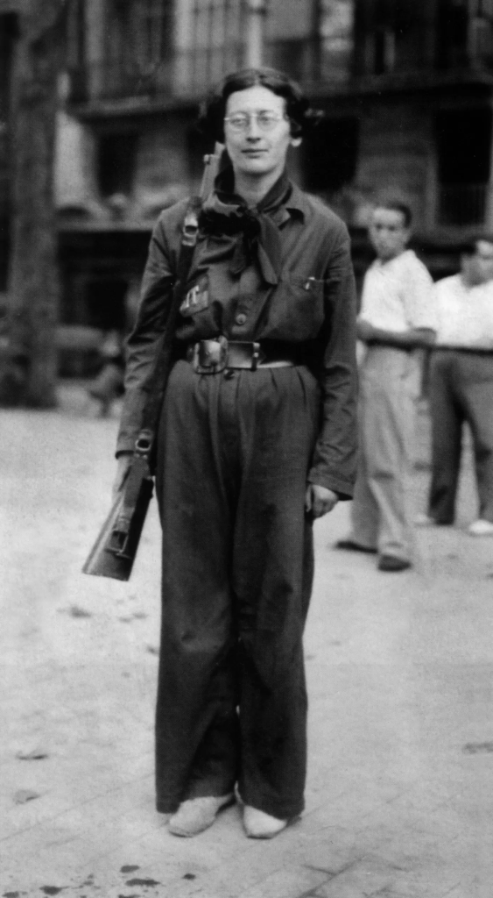

<!--

author: Moritz Riemann
email:  riemann@philsem.uni-kiel.de
version: 0.1
language: en
narrator: UK English Female

-->

# Simone Weil: Krieg und Gewalt

**Dozent:**

* Moritz Riemann (riemann@philsem.uni-kiel.de)

**Zeit und Raum:** Dienstag, 12-14, LMS11a - R.EG.004

**Inhalt**

* Geschichte der Philosophie: Gegenwart (BA 2)
* Einführung in die praktische Philosophie (BA 4)
* Praktische Philosophie: Vertiefung (BA 6)
* Philosophische Reflexion und ethische Urteilskraft

**Literatur**

* Simone Weil: Krieg und Gewalt - Essays und Aufzeichnungen. Zürich 2011.
* Simone Weil: Deutschland wartet. In: Zur proletarischen Revolution. Syndikalistische Schriften (1931–1934). Wien 2024.
* Simone Weil: Reflexionen über die Ursachen der Freiheit und sozialen Unterdrückung. Zürich 2012.

### Semesterplan

| Datum | Thema, Inhalt |
|-------|---------------|
| 16.04.2024 | Eröffnung, Organisatorisches |
| 23.04.2024 | Deutschland wartet |
| 30.04.2024 | Gedanken über den Krieg |
| 07.05.2024 | Antwort auf eine Frage von Alain; Spanisches Tagebuch; Missliebige Gedanken |
| 14.05.2024 | Beginnen wir den trojanischen Krieg nicht von Neuem |
| 21.05.2024 | Gedanken über die Barbarei; Einige Überlegungen zu den Ursprüngen des Hitlerismus |
| 28.05.2024 | Einige Überlegungen zu den Ursprüngen des Hitlerismus |
| 04.06.2024 | Die Ilias oder das Poem der Gewalt |
| 11.06.2024 | Die Ilias oder das Poem der Gewalt |
| 18.06.2024 | Dieser Krieg ist ein Krieg von Religionen |
| 25.06.2024 | Reflexionen über die Ursachen der Freiheit und sozialen Unterdrückung (Auszug) |
| 02.07.2024 | Reflexionen über die Ursachen der Freiheit und sozialen Unterdrückung (Auszug) |
| 09.07.2024 | Abschlussdiskussion |

### "Regierungserklärung"

1. Die Teilnahme am Seminar erfordert die vorbereitende, gründliche Lektüre der Texte.
2. Eine regelmäßige und aktive Teilnahme aller Seminarteilnehmenden ist Voraussetzung für ein gelingendes Seminar.
3. Philosophische Seminare leben vom diskursiven Austausch. Nehmt in Euren Diskussionsbeiträgen auf den Text und aufeinander Bezug, lasst einander ausreden und vermeidet lange, abschweifende Exkurse.
4. Meine Sprechsstunde (Mittwoch 16:15) ist offen für alle Anliegen, es ist keine Anmeldung erforderlich.
5. Bevor Ihr eine Email schreibt: Seht im Seminarplan nach, ob die gesuchte Information dort zu finden ist.

### Prüfungsleistungen

**BA 2:**

* Ergebnisprotokoll im Umfang von 2-3 Seiten. Das Protokoll soll die wesentlichen Inhalte einer Seminarssitzung ergebnisorientiert und systematisch zusammenfassen. Die Anmeldung zum Protokoll erfolgt zu Beginn der Sitzung. Es ist bis Montag, 12 Uhr nach der protokollierten Sitzung im OLAT-Teilnehmerordner hochzuladen und dient damit der Rekapitulation zu Beginn der folgenden Sitzung. Beachten Sie die Handreichung zum Erstellen eines Protokolls im OLAT-Ordner

**BA 4:**

* Take-Home-Klausur im Umfang von 5-6 Seiten. Die Aufgabenstellung erfolgt in der letzten Sitzung. Abgabe: 30.09.2024

**BA 6:**

* Hausarbeit im Umfang von 10 Textseiten. Individuelle und eigenständige Themenfindung aus dem Themenbereich des Seminars. Ein persönliches Gespräch mit dem Dozenten (Sprechstunde) zur Vorbereitung ist Voraussetzung für die Annahme der Arbeit. Abgabe: 30.09.2024

**PHF-phil-WP:**

* Essay im Umfang von 5-7 Textseiten. Individuelle und eigenständige Themenfindung aus dem Themenbereich des Seminars. Ein persönliches Gespräch mit dem Dozenten (Sprechstunde) zur Vorbereitung ist Voraussetzung für die Annahme der Arbeit. Abgabe: 30.09.2024

### Literatur über Simone Weil

* Jacques Cabaud: Simone Weil. Logik der Liebe. Verlag Karl Alber, Freiburg/ München 1968.
* Heinz-Robert Schlette, André Devaux (Hrsg.): Simone Weil: Philosophie, Religion, Politik. Frankfurt am Main 1985.
* Imelda Abbt, Wolfgang W. Müller (Hrsg.): Simone Weil. Ein Leben gibt zu denken. Eos Verlag, St. Ottilien 1999.
* Heinz Abosch: Simone Weil. Eine Einführung. Panorama, Wiesbaden ca. 2005.
* Simone Pétrement: Simone Weil. Ein Leben. Universitätsverlag, Leipzig 2007.
* Palle Yourgrau: Simone Weil. Reaktion Books, London, 2011.
* Nina Heinsohn: Simone Weils Konzept der attention. Mohr Siebeck, Tübingen 2018.
* Robert Zaretsky: The subversive Simone Weil : a life in five ideas. Chicago ; London : The University of Chicago Press, 2021.

### Simone Weil im Internet

**Sonstige Beiträge**

* Deutschlandfunk: Simone Weil: „Schwerkraft und Gnade“ Aktivistin und Mystikerin
* Deutschlandfunk Kultur: Simone Weil – Philosophin und Widerständlerin https://www.deutschlandfunkkultur.de/vor-75-jahren-gestorben-simone-weil-philosophin-und-102.html
* Deutschlandfunk Kultur: Vier Denkerinnen gegen den Totalitarismus https://www.deutschlandfunkkultur.de/wolfram-eilenberger-feuer-der-freiheit-vier-denkerinnen-100.html
* Ursula Homan (Freie Publizistin): Eine Jüdin, die keine sein wollte | Vor 60 Jahren starb Simone Weil im Exil
* The New York Times: What We Owe to Others: Simone Weil’s Radical Reminder https://www.nytimes.com/2018/02/20/opinion/simone-weil-human-rights-obligations.html
* Tom Vandeputte (Weiter denken: Journal für Philosophie): Simone Weil: Archäologie des Politischen https://weiter-denken-journal.de/fruehjahr_2023_simone_weil/Archaeologie_des_Politischen.php
* Esther Heinrich-Ramharter (Weiter denken: Journal für Philosophie): Ein Denken der zweiten Potenz. Religion und Mathematik bei Simone Weil https://weiter-denken-journal.de/fruehjahr_2023_simone_weil/Denken_der_zweiten_Potenz.php

**Audio/ Film**

* Zeitzeichen der Geschichtspodcast (WDR): Simone Weil, widerspenstige Philosophin https://www1.wdr.de/radio/wdr5/sendungen/zeitzeichen/zeitzeichen-SimoneWeil100.html
* Sternstunde Philosophie (YouTube): Simone Weil – Radikale Denkerin https://www.youtube.com/watch?v=7ya1N4fnqvA
* Dokumentarfilm/Drama: An Encounter with Simone Weil (Trailer) https://www.imdb.com/title/tt1692259/
* Kaija Saariaho: Oratorium «La Passion de Simone» (dazu auch hier) https://www.youtube.com/watch?v=vQnnTK66y5s https://foyer.de/mediathek/kaija-saariaho-oratorium-la-passion-de-simone/

**Rezensionen**

* Süddeutsche Zeitung: "Schwerkraft und Gnade" der Philosophin Simone Weil:Wo das Ich sich auflöst https://www.sueddeutsche.de/kultur/simone-weil-philosophie-1.5221061?reduced=true

**Zur Person**

* FemBio: Simone Weil https://www.fembio.org/biographie.php/frau/biographie/simone-weil/
* Metzler Philosophie-Lexikon (Spektrum der Wissenschaft): Simone Weil https://www.spektrum.de/lexikon/philosophen/weil-simone/349
* Antje Schrupp (Politikwissenschaften): Zum 100. Geburtstag von Simone Weil https://www.antjeschrupp.de/simone-weil
* Stanford Encyclopedia of Philosophy: Simone Weil https://plato.stanford.edu/entries/simone-weil/

## 1. Sitzung 16.04.2024

### Biographisches 

* 3.Februar 1909 (Paris) - 24.August 1943 (Ashford, England)
* Kind einer großbürgerlichen jüdischen Familie
* ab 1924 Studium der Philosophie, ab 1928 an der ENS in Paris
* 1931-1934 Engagement für den revolutionären Syndikalismus; Philosophielehrerin in Le Puy (gibt die Hälfte ihres Gehalts an Arbeitslose ab)
* 1932 Aufenthalt in Berlin (Deutschland wartet); Kontakt mit Leo Sedow, Nähe zu den Trotzkisten, Kritik am Sowjetkommunismus
* Ende der Lehrtätigkeit, Arbeit als ungelernte Fabrikarbeiterin (Fabriktagebücher)
* 1936 Kurzer Einsatz im spanischen Bürgerkrieg

„Ein Menschenleben gilt in Spanien nichts. In einem Land, in dem die Armen in ihrer großen Mehrheit Bauern sind, muß die Besserstellung der Bauern für jede Gruppierung der extremen Linken ein wesentliches Ziel sein; und der Bürgerkrieg war anfangs vielleicht in der Hauptsache ein Krieg für (und gegen) die Aufteilung des Landes an die Bauern. Was geschah? Diese blutarmen, großartigen Bauern von Aragon, die unter allen Demütigungen ihren Stolz bewahrt hatten, waren für die Milizsoldaten aus der Stadt nicht einmal ein Gegenstand der Neugier. Ohne daß es zu Übergriffen, Unverschämtheiten, Beleidigungen gekommen wäre – ich jedenfalls habe nichts davon bemerkt, und ich weiß, daß bei den Kolonnen der Anarchisten auf Raub und Vergewaltigung die Todesstrafe stand – trennte ein Abgrund die Soldaten von der unbewaffneten Bevölkerung, ein Abgrund, der ebenso tief war wie der zwischen Armen und Reichen“
(Simone Weil, zitiert nach Hans Magnus Enzensberger: Der kurze Sommer der Anarchie. Buenaventura Durrutis Leben und Tod. Suhrkamp, Frankfurt am Main 1972, S. 162 f.)

* Spirituelle Annährung an die katholische Lehre ohne Eintritt in die Kirche
* 1940 Flucht vor der Gestapo nach Marseille
* 1942 Flucht über die USA nach England. Dort Arbeit im Beferiungskomitee von de Gaulle
* 1943 stirbt Weil an an den Folgen ihrer jahrelangen Mangelernährung. Sie hatte ihre Nahrungsaufnahme auf das beschränkt, was ihrer Meinung nach die Bewohner des von den Deutschen besetzten Frankreichs aßen.

**Schriften**

**deutsche Übersetzung**

* Schwerkraft und Gnade. Übers. Friedhelm Kemp. München 1952. (La pesanteur et la grâce) neu herausgegeben von Charlotte Bohn und mit einem Essay von Frank Witzel. Matthes & Seitz, Berlin 2020, ISBN 978-3-95757-934-8.
* Das Unglück und die Gottesliebe. Übers. Friedhelm Kemp. München 1953. (Attente de Dieu)
* Die Einwurzelung, Einführung in die Pflichten dem menschlichen Wesen gegenüber. Übers. Friedhelm Kemp. Kösel, München 1956 (L’Enracinement) Neuübers. Marianne Schneider: Die Verwurzelung. Vorspiel zu einer Erklärung der Pflichten dem Menschen gegenüber. diaphanes, Zürich 2011, ISBN 978-3-03734-161-2.
* Unterdrückung und Freiheit. Politische Schriften. Übers. Heinz Abosch. Rogner & Bernhard, Frankfurt am Main 1975; Zweitausendeins, Frankfurt am Main 1987.
* Zeugnis für das Gute: Traktate, Briefe, Aufzeichnungen. Hg. u. Übers. Friedhelm Kemp. Walter, Olten/Freiburg i. Br. 1976 / dtv, München 1990 / Benziger, Zürich 1998.
* Fabriktagebuch und andere Schriften zum Industriesystem. Übers. Heinz Abosch. Suhrkamp, Frankfurt am Main 1978.
* Aufmerksamkeit für das Alltägliche. Hg. Otto Betz. Kösel, München 1987.
* Entscheidung zur Distanz: Fragen an die Kirche. Übers. Friedhelm Kemp. Kösel, München 1988.
* Cahiers. Aufzeichnungen. Hrsg. und übers. von Elisabeth Edl und Wolfgang Matz. 4 Bände. München 1991–1998.
* Gedichte. Übers. Elisabeth Edl, Wolfgang Matz. In: Akzente (Zeitschrift). 1998, H. 4.
* Anmerkung zur generellen Abschaffung der politischen Parteien. Übers. Esther von der Osten. diaphanes, Zürich 2009, ISBN 978-3-03734-059-2.
* Krieg und Gewalt. Essays und Aufzeichnungen. Übers. Thomas Laugstien. diaphanes, Zürich 2011, ISBN 978-3-03734-142-1.
* Notizen zur Abschaffung der politischen Parteien. (Zweispr. Ausg. Deutsch/Französisch). Hg. u. Übers. Willibald Feinig. Verlag Bibliothek der Provinz, Weitra 2022, ISBN 978-3-99126-113-1.
* Von der Schwierigkeit, den Kopf zum Himmel zu heben. Übersetzt von Tabea Rotter, mit einem Vorwort von Britta Müller-Schauenburg, Westend, Frankfurt 2023, ISBN 978-3-86489-400-8.

**in Französisch**

* Œuvres complètes. Hgg. André-A. Devaux, Florence de Lussy. Gallimard, Paris 1988 ff. Ab 2012 ist der Herausgeber Robert Chenavier. Von den 16 Bänden, die in 7 geplante Bände unterteilt sind, sind bisher 12 erschienen
* Œuvres. Gallimard, collection « Quarto », 1999.
* Grèves et joie pure. Libertalia, 2016, ISBN 978-2-918059-87-5.
* La personne et le sacré. Préface de Florence de Lussy, RN Éditions, 2016.
* Désarroi de notre temps et autres fragments sur la guerre. présentation, notes et index par Pascal David, postface de Paul Colrat, Éditions Peuple Libre, 2016.
* Luttons-nous pour la Justice? Manuel d’action politique. présentation, étude, notes et index par P. David, éditions Peuple Libre, 2017.
* Amitié: L’art de bien aimer. Rivages poche, 2017, ISBN 978-2-7436-3596-1.
* Force et malheur. Éditions la Tempête, 2019, ISBN 979-10-94512-08-1.

### Hinweise für das Verfassen von Sitzungsprotokollen im Modul BA 2

#### I. Grundformen und Funktionen

1. Wortprotokoll, Verbalprotokoll – direkte Dokumentation des mündlichen Wortlauts z.B.
bei Gerichtsverhandlungen
2. Verlaufsprotokoll, Verhandlungsprotokoll – Protokoll des Gesprächsprozesses. Wie kam
es zu Beschlüssen oder Ergebnissen? Wie lauteten die Argumente?
3. Ergebnisprotokoll, Beschlussprotokoll – Fokus auf Ergebnisse. Keine Dokumentation des
Gesprächsprozesses.
4. Das wissenschaftliche Protokoll – Anteile des Verlauf- und Ergebnisprotokolls.
Schriftliche und systematische Wiedergabe diskursiv erarbeiteten Wissens, die eine
gemeinsame Wissensbasis schafft. Funktionen: Dokumentation und Aufbereitung des
Wissens, Literaturgrundlage, Kontrolle des Wissensstandes, Üben wissenschaftlichen
Formulierens

#### II. (Sprachliche) Gestaltung

1. Der Protokollkopf: Name der Hochschule, Institut, Seminartyp, Seminarleitung, Protokollant:in, Semester, Datum.
2. Der Protokolltext: Der Text ist im Präsens zu verfassen. Bei Bezügen auf den Seminarverlauf - also was eine Person sagte - wird Präteritum gewählt. Das Protokoll ist in ganzen Sätzen (nicht in Stichpunkten) zu formulieren. Ergebnisse sollen dargestellt werden, allerdings auch deren diskursiver Zusammenhang berücksichtigt werden. Die namentliche Nennung von Sprecher*innen ist nicht angebracht. Besonders wichtige Aspekte können markiert oder hervorgehoben werden. Auch sollte das Protokoll sinnvoll durch Überschriften und Zwischenüberschriften (Thema und Unterthemen der Sitzung) strukturiert werden. Übliche Länge sind zwei bis drei DIN-A 4-Seiten.
3. Der Anhang: Bibliographie der Literatur der Seminarsitzung / Folien auf die Bezug genommen wurde.
4. Textformat: Serifenfont (z.B. Times New Roman) 12pt, Fußnoten 10pt., Zeilenabstand 1,5, Blocksatz, Seitenränder 3cm links, 3cm rechts 

#### III. Herausforderungen

* Balance zwischen diskursivem Verlauf und Ergebnissen -> Herausarbeitung der (zentralen) Ergebnisse. 
* Balance zwischen sprachlicher Verknappung/Abstraktion und Wiedergabe der Beiträge. Bitte keine Umgangssprache verwenden. Auf korrekte Fachlexik achten. 
* Das Protokoll vor der Abgabe Korrektur lesen (lassen).
* Formal: Protokollkopf einfügen, Gliedern und Strukturieren, Literaturangaben nicht vergessen, Markierungen einheitlich verwenden. (siehe Checkliste) 

#### IV. Fünf Schritte bei der Erstellung des Protokolls 

1. **Vorbereitung.** 

Die zu protokollierende Sitzung sollte gut vorbereitet sein.

2. **Rezeption der Seminarsitzung.**

Die anspruchsvolle Aufgabe, Inhalte zu komprimieren und zu strukturieren ist durch eine Tonaufnahme nicht bewältigt, sondern nur vertagt. Außerdem erfordert die Aufnahme das Einverständis des gesamten Plenums. Hören Sie gut zu und seien Sie gnädig mit sich, wenn Sie nicht die vollen 90 Minuten jeden Satz verstehen. 

3. **Mitschrift während der Sitzung.** 

Wichtige Inhalte müssen dokumentiert werden – gern auch in Stichpunkten oder unter Verwendung von Symbolen und Verweisen. Es ist nicht leicht zu entscheiden, was wichtig und was weniger wichtig ist. Hier hilft es Ihnen, wenn Sie exzellent auf die Seminarsitzung vorbereitet sind. Achten Sie auf folgende Aspekte: 

    * Quantität der Besprechungsdauer – Wie lange wurde ein Aspekt besprochen? 
    * Top-down denken. Lässt sich die Sitzung in Themenclustern beschreiben? Wie lässt sich eine Struktur herstellen? 
    * Gesamtdiskurs aufzeigen. Welche Aspekte vergangener Sitzungen wurden aufgegriffen?
    * Bilanz ziehen. Offene Fragen nennen. 

4. **Komprimieren und Reproduzieren.** 

Es bietet sich an, die Mitschrift so schnell wie möglich zu bearbeiten, da die Inhalte dann noch frisch erinnert werden. Ergänzen Sie nun aus dem Gedächtnis oder aus Ihren Materialien wichtige Aspekte ihrer Mitschrift und bringen Sie die Inhalte in eine Struktur (die von der Chronologie des Seminars abweichen kann). 

5. **Erstellen des Protokolls.** 

Die Stichpunkte und Notizen müssen nun in ganze Sätze und eine kohärente Form gebracht werden. Möglicherweise wird der Text auch nochmals umstrukturiert. Der fertige, korrigierte Text kann auch nochmal anhand der Funktionen des Protokolls überprüft werden. Kann eine fremde Person den Sitzungsverlauf und -inhalte nachvollziehen?

#### V. Checkliste vor der Abgabe

 1. Hat Ihr Protokoll einen Kopf?
 2. Ist Ihr Text einheitlich formatiert, im Blocksatz und unter Berücksichtigung der Seitenränder? Stimmen die Seitenumbrüche? Haben Sie Seitenzahlen angegeben?
 3. Haben Sie die Textgrundlage der Sitzung und weitere Quellen einheitlich und eindeutig bibliographisch nachgewiesen?
 4. Besteht Ihr Text aus ganzen und klar verständlichen Sätzen?
 5. Haben Sie Orthographie und Grammatik korrekturgelesen? Haben Sie Fremdwörter und Fachbegriffe nachgeschlagen und deren korrekte Schreibweise überprüft?
 6. Haben Sie die Sitzungsinhalte gegliedert?
 7. Ist Ihr Text ergebnisorientiert verfasst?
 8. Lassen sich die wichtigsten Inhalte der Sitzung anhand Ihres Textes nachvollziehen? Stellen Sie sich vor, Sie müssten einer Kommiliton:in berichten, die bei der Sitzung fehlte.
 9. Bei digitaler Abgabe: Haben Sie Ihr Dokument als .pdf exportiert?
10. Haben Sie alle Punkte der Checkliste berücksichtigt?
11. Haben Sie Ihr Protokoll auf OLAT in den Abgabeordner geladen? 

Quelle: Kirsten Schindler: Klausur, Protokoll, Essay. Kleine Texte optimal verfassen, Paderborn 2011.

## 3. Sitzung am 30.04.2024

Textgrundlage:

* Gedanken über den Krieg [November 1933]

Protokoll: Cedric A. Smerling

**Rekapitulation & historischer Kontext**

Eingangsfrage: Was ist die politische Situation in Europa im Jahre 1933?

Das Plenum nennt anbahnende Krisen, Verunsicherungen in der Bevölkerung und den
kommenden Koalitionskrieg als Kontext. Weiter gibt es ein Erstarken des
Nationalsozialismus in Deutschland, seitdem Hitler die Position des Reichskanzlers
bekleidet, zudem gibt es zu der Zeit viele weitere faschistisch orientierte Länder in
Europa wie z. B. Italien. Im Kontrast dazu gibt es in anderen Ländern auch
demokratische und kommunistische Systeme. Die europäische Politik ist sehr
heterogen. Auch wird hohe Arbeitslosigkeit genannt, was zu hoher Unzufriedenheit in
der Bevölkerung führt. Ergänzend dazu erwähnt die Seminarleitung, dass seit 1929 eine
Weltwirtschaftskrise (verursacht durch den Börsencrash) anhält, welche die Bildung von
extremen Ideologien, genährt durch die große Unzufriedenheit, begünstigt. Eine weitere
wichtige Wendung in der Geschichte ist Deutschlands Austritt aus dem Völkerbund im
Jahre 1933, welcher eine erste außenpolitische, faschistische Bewegung im
europäischen Raum darstellt. Das Plenum erwähnt noch weitere, historisch bedeutsame
Schlüsselbegriffe wie Dolchstoßlegende, Schande von Versailles und Einigungskriege.
Die Begriffe werden auf Wunsch der Seminarleitung genauer erläutert.
Im Zuge dessen wird die “deutsch-französische Erbfeindschaft” genannt, welche bis zur
Zeit Napoleons zurückgeführt werden kann. Im Geiste dieser Erbfeindschaft wird der
erste Weltkrieg begonnen und es sollte auch nicht mehr lange dauern (etwa 6 Jahre) bis
in ähnlicher Weise der zweite Weltkrieg ausbricht. Ergänzend dazu erwähnt das Plenum,
dass Uneinigkeit über die Besetzung von Elsaß-Lothringen wiederholt zu politischen
Spannungen zwischen Deutschland und Frankreich führt. Die bereits genannte
Unzufriedenheit in der Arbeiterklasse führt des Weiteren zu einer Schwächung der
kommunistischen Partei und um 1932 endet die “heftige” deutsche Sparpolitik und
Deutschland versucht mit dem Drucken von Geld und Arbeitsbeschaffungsmaßnahmen
der Weltwirtschaftskrise entgegenzuwirken.

**Essay: Gedanken über den Krieg**

Gruppenarbeit:  

1. Mit welchem Vokabular beschreibt Weil den Krieg? 
2. Wie denkt Weil über den Krieg?
3. Welcher Ausdruck wird wahrgenommen // was fällt besonders auf?

Ergebnisse: 

Der Krieg wird mit Begriffen wie Arbeiterkampf und Klassenkampf in Verbindung gebracht. Auch wird der Krieg als Maschine beschrieben, die alles und jeden zermalmt, der kein Zahnrad in dieser Maschine ist. Weil appelliert dabei an die Vernunft und betont den Irrsinn des Krieges. Sie bezeichnet den Krieg als Gemetzel, was sehr emotional erscheint. Insbesondere bezogen auf ein Zitat von Liebknecht: “der Hauptfeind steht im eigenen Land”, was wohl zeigen soll, dass der eigentliche Feind der Staat ist, der sein eigenes Volk “verheizt”. 

Die Relevanz des Satzes von Clausewitz wird hervorgehoben, nach dem der Krieg nur die Politik der
Friedenszeit fortsetzt, aber mit anderen Mitteln. Ergänzend dazu erwähnt die
Seminarleitung, dass Krieg oft genutzt wird, um verlorene nationale Einigkeit
wiederherzustellen, indem man ein gemeinsames, externes Feindbild konstruiert. Im
Rahmen der Diskussion kommt die **Korrelation zwischen Revolution und Krieg** (oder
auch revolutionärer Krieg) auf, welche von Weil ad absurdum geführt wird. Weil sehnt
sich gemäß ihrer anarchistischen Ansichten eigentlich nach einer Revolution, welche
ein System ins Leben ruft, welches auf autoritäre Systeme und Strukturen verzichtet,
allerdings muss man die herrschenden Aktionäre i.d.R. mit Hilfe ebendieser Systemen
und Strukturen unterwerfen und es entsteht ein neues autoritäres System. Man könnte
diesen Sachverhalt als *Paradoxie des Revolutionären Krieges* bezeichnen.

**Weitere Ansichten von Weil über den Krieg**

In diesem Teil der Diskussion wird der Revolutionsbegriff weiter erörtert. Die
Seminarleitung wirft ein, dass Weil nicht streng pazifistisch ist, allerdings den Krieg als
Mittel zu revolutionistischen Zwecken verurteilt. Weil sagt “Der Revolutionskrieg ist
der Tod jeder Revolution”[1], solange Bürger und Soldaten nicht die volle Macht
ausüben. Sobald eine Revolution (Überwinden der staatlichen Autorität mit allen
Mitteln) das Ausmaß eines Krieges annimmt, übernimmt der Staat die Führung und
verfolgt stets nur noch seine eigenen Interessen. Ein anti-autoritärer Krieg wäre eine
Lösung, für die es aber bislang keine Umsetzung gibt. Das Plenum ergänzt, dass global
die meisten Revolutionen erfolglos bleiben und durch jene Fehlschläge oft zu einer
Stärkung des Staatsapparates und zu Frust in der Bevölkerung führen. Auch passen
Revolution und Krieg begrifflich nicht wirklich zusammen, da sich Revolution meist
innenpolitisch (als Machtwechsel) und Krieg meist außenpolitisch (zwischen Staaten) abspielt. Nach Weil sind Revolution und Krieg grundsätzlich verschieden, aber
historisch betrachtet werden sie immer wieder in Zusammenhang gebracht (Revolution
mündet oft in Krieg). Eine ungeklärte zentrale Frage bleibt: “Wie bekämpft man
Faschismus, vor allem ohne Krieg als Mittel zum Zweck?”

**Erarbeitung einer zweiten Kernaussage**

Eine weitere zentrale Frage stellt sich im Plenum: “Was verstehen wir unter
Revolution?”. Die Seminarleitung erläutert, dass das Ziel der Revolution klar ist. Es
sollen Lebensbedingungen für Menschen geschaffen werden und der Ausbeutung soll
ein Ende gesetzt werden. Unklar ist jedoch, mit welchen Mitteln das umgesetzt werden
kann und es ist auch unvorhersehbar, wie die Gesellschaft nach einem solchen
Umschwung aussehen wird. Weiter stellt sich heraus, dass der Faschismus für Weil
keine echte Arbeiterbewegung ist. In deutschen Konzentrationslagern herrschen
menschenfeindliche Bedingungen und auch im Kommunismus liegt nicht die Lösung
des Arbeiterproblems. Schließlich stellt sich heraus, dass Weils Ansicht von Revolution
und Gewalt in zukünftigen Sitzungen noch weiter elaboriert werden muss. Ein zentrales
Problem kristallisiert sich aus den vorangegangenen Informationen jedoch heraus. Im
Krieg und auch in der Revolution wird der Mensch als Mittel zum Zweck genutzt und
missbraucht. Er wird instrumentalisiert.

**Abschluss der Sitzung / Fazit / Zusammenfassung**

Die Seminarleitung stellt dem Plenum die Frage: “Was nehmt ihr aus der Sitzung mit?”.
Plenum nennt hohe Empathie seitens Weil für die (deutschen) Arbeiter und allgemein
großen Bezug Arbeitern im Rahmen ihrer Texte. Auch wird Weils bildhafte Sprache
erwähnt. Es stellt sich heraus, dass die innenpolitische Betrachtung des Krieges gänzlich
andere Erkenntnisse liefert als die außenpolitische. Der Krieg wird als Klassenkampf
zwischen Herrschaft und Arbeiterschaft wahrgenommen. Des Weiteren erweckt Weil
einen Eindruck der Sinnlosigkeit vom Krieg und gibt eine kritische
Gesellschaftsanalyse ab. Es wird der Eindruck einer politisch systemischen Kontinuität
des Krieges gewonnen, in der Krieg kein Bruch des Systems ist, sondern nur ein
(temporärer) Bruch des Friedens. Abschließend wird ergänzt, dass bei allen Schrecken,
die der Krieg birgt, dieser im Prinzip ein politisches Werkzeug ist, mit dessen Nutzung
gerechnet werden muss. Abschließend gibt es einen kurzen Ausblick auf die kommende
Sitzung, insbesondere in Hinblick auf die Heterogenität von Weils Texten.

## 4. Sitzung am 07.05.2024

Textgrundlage:

* Antwort auf eine Frage von Alain [März 1936]
* Spanisches Tagebuch [August 1936]
* Missliebige Gedanken [Oktober 1936]

**Alain**

* eig. [Émile-Auguste Chartier](https://de.wikipedia.org/wiki/%C3%89mile_Chartier) [1868-1951]
* frz. Denker und Schriftsteller, Lehrer u.a. von [Raymond Aron](https://de.wikipedia.org/wiki/Raymond_Aron) [1905-1983], [Georges Canguilhem](https://de.wikipedia.org/wiki/Georges_Canguilhem) [1904-1995] und eben Simone Weil.
* enger literarischer und gedanklicher Austausch

